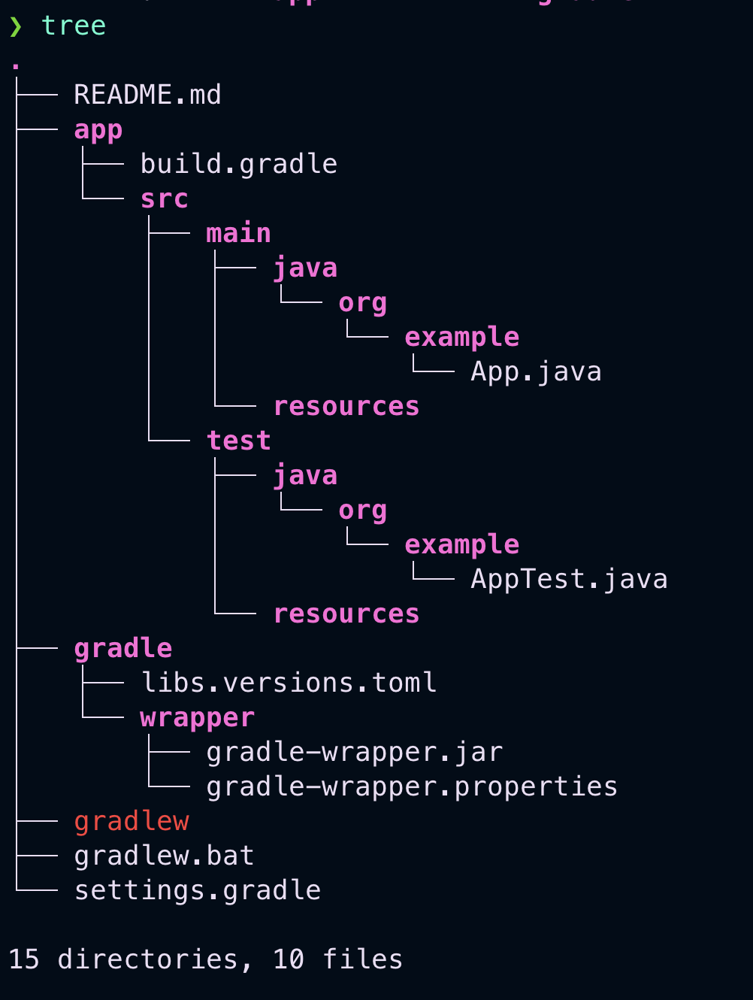

# Gradle

It is a build system that is used widely

This is regarding how to run and setup gradle from the cli and not using any IDE

- Step 1: `brew install gradle` to install gradle on our machine may vary for other operating system

- Step 2: Run the command to set up a gradle (initialize gradle)

```
gradle init --type java-application  --dsl groovy --use-defaults
```

- If you dont use the `--use-defaults` it will ask you all the details and you can have some flexibility on how you want to setup your project

- It will give us a default project setup



Now how to run our project or the App,java in the main folder

- gradlew is the shell script file caan perform various tasks for us (gradlew.bat is similar file but for windows)

- `./gradlew build` It will build the project for us by creating a build folder inside app

- `./gradlew clean` It will delete the build folder for us

- `./gradlew jar` It will make a jar file for us with which we will be ablee to run our java project easily

- `java -jar JAR_FILE_PATH` will run the jar file for us but will give a error at first no manifest someting so to tackle that error we have to introduce the manifest variable (where the execution should start from)

- So to introduce the manifest variable we have to add following code to `build.gradle` file

```
jar{
	manifest{
		attributes(
			'Main-Class' : 'org.example.App'
		)
	}
}
```

- We can also do `./gradlew run` to run the project (simpler method compared to the jar method)
